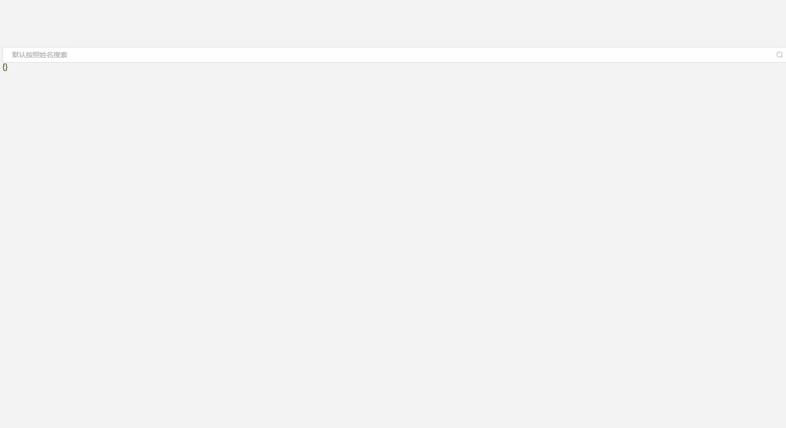

# 基于element-plus 封装 多功能搜索盒子


 # 使用方法

```html
<template>
    <div >
        <SearchBox :fields="fields" v-model="searchModel" @submit="submit" autoSubmit iconSubmit></SearchBox>
        {{searchModel}}
    </div>
</template>

<script setup lang="ts">
import SearchBox from "search-box";
import {IFormItem} from "search-box/src/interface";
import {EFormItemType} from "search-box/src/types";
import {ref} from "vue";

const searchModel = ref()
const fields:IFormItem[] =[
    {
        label:'姓名',
        name:'name',
        type:EFormItemType.input
    },
    {
        label:'日期',
        name:'time',
        type:EFormItemType.daterange
    },
    {
        label:'带时分秒的时间',
        name:'time2',
        type:EFormItemType.datetimerange
    },
    {
        label:'类型',
        name:'type',
        type:EFormItemType.select,
        options:[
            {
                label:'第一个',
                value:'1'
            },
            {
                label:'第二个',
                value:'2'
            }
        ]
    }
]
const submit = ()=>{
    console.log(searchModel.value)
}
</script>

<style scoped lang="scss">

</style>
```